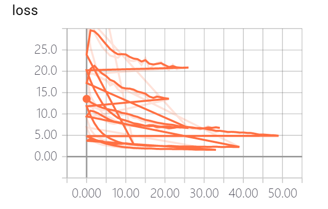
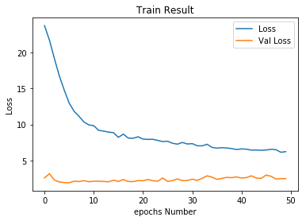
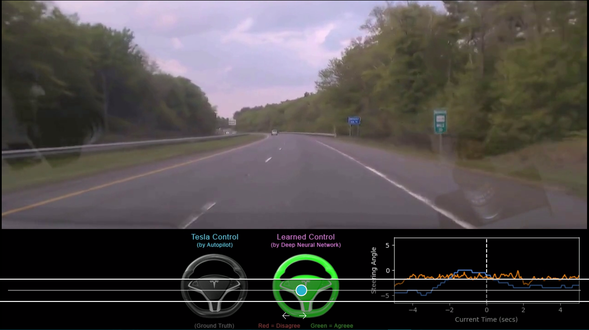
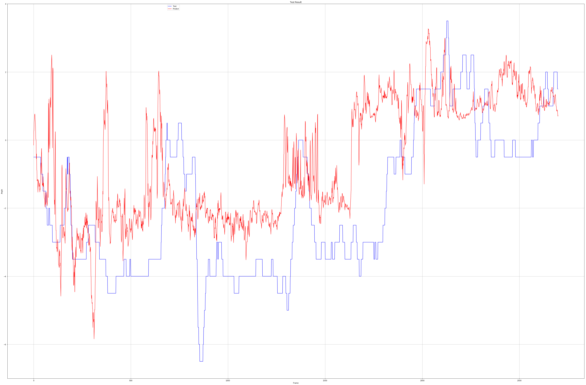

# 机器学习纳米学位
##自动驾驶汽车深度学习: DeepTesla
杨奕

2018年2月9日


## I. 问题的定义

### 项目概述

自动驾驶是近年来人工智能研究领域里比较热门及相对成熟的技术，已经有很多实用的产品出现，如特斯拉的自动辅助驾驶系统AutoPilot，百度的Apollo自动驾驶系统，英伟达自动驾驶技术及解决方案。麻省理工还专门开了一个公开课讲授自动驾驶技术（MIT 6.S094 ），这门课程包括DeepTraffic，DeepTesla等部分，其中DeepTraffic主要是通过强化学习训练车辆识别信号灯、障碍物，而DeepTesla主要是使用深度学习的图像识别技术控制车辆行驶的方向，就是根据人类驾驶或机器驾驶录制的车辆前方视频及相应的车辆转弯角度数据来训练的端到端的汽车自动驾驶，即通过车辆行驶前方图像来控制车辆运行方向。

自动驾驶技术包括很多方面，而通过模仿人类视觉观察道路来判断驾驶方向是其中最基础的功能。以往可能需要开发各种算法来判断道路方向，但在深度学习时代则可直接根据看到的道路图形，稍加处理甚至不用处理就能通过卷积神经网络和深度神经网络得到行驶方向，这种端到端的学习技术是人工智能发展必然方向。

这个项目的训练数据就是来源于这个公开课，包括十段汽车实际行驶的视频及记录的转向角度。我们要开发深度网络模型，使用这些视频的作为训练集和验证集来训练模型，使训练好的模型在输入一个新的道路图形时能尽可能正确判断行驶方向。

### 问题陈述

人类驾驶车辆在道路上行驶是通过眼睛来观察道路的弯曲程度，然后通过大脑处理后控制手来操控方向盘改变行车角度。深度学习的计算机视觉也可以达到这种程度，即通过计算机视觉对大量实际道路的行驶训练来学习到模型，通过这个模型可以计算出不同道路场景下车俩行驶的角度，从而达到与人类驾驶相同的效果。这种通过图像直接判断行驶方向的端到端的自动驾驶技术，如果模型设计合理及通过大量数据的训练应该可以达到或超过人类的驾驶水平。

这个项目需要使用计算机视觉技术来识别道路，是一个典型的图形识别问题，现在使用多层卷积神经网络已经可以达到很高的准确率，但这个项目不同的是预测的结果不是图形分类，而是道路弯曲的角度，因此需要将图像识别最终转换为线性回归问题。

项目开始时我们要将数据划分为训练集、验证集和测试集，并对数据进行一定的剪裁，在图像识别方面可以使用目前比较成熟的迁移学习方法，如使用VGG16,RESNET等模型的结构和权重对我们的训练集进行训练，由于这些模型主要是用于图像分类的，因此需要对顶部的全连接层和输出层进行改造，使用线性回归的激活函数拟合标注数据，在我们这里是转向角度。使用均方误差mse目标函数对数据进行多轮训练后，记录和跟踪训练集和验证集的损失率loss，直到损失率逐渐收敛，在训练过程中还要不断调整参数，使模型达到最优结果。最后可以通过项目提供给的实用工具代码对测试数据进行测试，生成预测结果并合成视频，可以直观的看到最后训练结果与实际角度的差距。

由于这个项目的训练数据很少，对道路转向的图像识别相对更复杂，因此最终模型很难达到能够实际应用的程度，这里主要是验证通过卷积神经网络实现端到端的自动驾驶的合理性，预测结果与实际结果的转向角度的大致趋势相同，在与训练数据相识的场景中的使用能达到一定的精度。

### 评价指标
由于这个项目是深度网络的回归问题，因此我们使用MSE方法对损失率进行测试，MSE为预测结果与真实结果的均方误差，MSE的公式如下：
$$
MSE=\frac{1}{n}\sum_{i=1}^{n}\left (Y_i - \widetilde{Y_i}\right)^{^{2}}
$$
另外还可以通过计算测试视频的预测结果与实际结果的决定系数R2,R2表示目标变量的预测值和实际值之间的相关程度平方的百分比，正常情况下这个系数在0-1之间，越接近1越好，R2的公式推导如下：

$$
SStot=\sum_{i}\left (y_i-\widetilde{y_i}\right )^{^{2}}
$$

$$
SS_\text{res}=\sum_i (y_i - f_i)^2=\sum_i e_i^2\
$$

$$
R^2 \equiv 1 - {SS_{\rm res}\over SS_{\rm tot}}
$$

## II. 分析
### 数据的探索

这个项目的训练数据同样来自MIT 6.S094课程，其中epochs目录下包括10段在多种道路上行驶的视频，文件从epoch01_front到epoch10_front，格式为mkv，这些视频可以直接通过视频软件播放。
另有10个对应的控制信号 CSV格式文件，文件的内容为ts_micro时间戳，frame_index帧编号，wheel转向角度（以水平方向为基准，+为顺时针，-为逆时针），这里对我们有用的是wheel，即训练数据的标注信息。其中视频文件中的每一帧在csv文件中都有对应的转向角度。
我们训练时就是读取视频文件中的每一帧图像作为特征数据，其对应的转向角度作为标注来训练。每帧图片大小为720`x`1280`x`3，在实际使用中要进行剪裁，每个视频文件的情况如下，可以看出视频包括不同的道路情况：

| 文件              | 帧数 | 场景                       | 是否自动驾驶 |
| ----------------- | ---- | -------------------------- | ------------ |
| epoch01_front.mkv | 1500 | 高速公路，前方车俩少       | 是           |
| epoch02_front.mkv | 3900 | 高速公路，前方车辆较多     | 是           |
| epoch03_front.mkv | 2700 | 桥梁上                     | 否           |
| epoch04_front.mkv | 2700 | 弯路多                     | 否           |
| epoch05_front.mkv | 2700 | 二车道，在里侧通行         | 否           |
| epoch06_front.mkv | 2700 | 傍晚，在里侧通行，有隔离网 | 否           |
| epoch07_front.mkv | 2700 | 在中间车道通行，两边是树木 | 是           |
| epoch08_front.mkv | 2700 | 二车道，在里侧通行         | 否           |
| epoch09_front.mkv | 2700 | 在中间车道通行，两边是树木 | 是           |
| epoch10_front.mkv | 2700 | 在中间车道通行，两边是树木 | 是           |

如果直接使用原视频图片大小，需要使用大量内存，训练系统资源有限可能无法完成训练，因此我们需要对图片进行剪裁，剪切掉视频顶部1/3的位置和底部150像素(车头部位)，同时将图片大小调整为64`x`64`x`3。下面截取视频04的6副图片样本如下：


### 探索性可视化

车辆行驶的转向是与道路的弯曲程度相关的，这里对车辆前方图片的识别就是要判断道路弯曲程度，在训练模型前我们需要先观察一下转向角度的范围，从所有10个视频的CSV文件提取的角度分布如下图：


可以看到数据大部分集中在-6.5度到3.5度之间，其中-3度占据的数量最多

另外对每个视频的角度分布进行分析，可以了解视频之间的差距，下图是01-10视频文件的转向角度曲线分析：


可以看到04、05、06、08的转向角度差异很大，其余则比较平稳。

### 算法和技术

对于行车道路的识别是一个典型的图像识别技术，目前最成熟的技术是深度学习中的卷积神经网络，卷积神经网络是通过设置多层的卷积层、池化层、非线性激活函数，将数据输入层高层信息抽取出来，逐层抽象。在这里卷积的作用是进行特征提取，有研究已经表明，通过卷积层的操作各层得到的深度特征会逐渐从泛化特征（如：边缘、方向）过度到高级特征（如：车轮、文字），对于我们的项目则是识别出道路边缘、道路方向和其他车辆、警示牌等障碍物。

卷积层之后是若干层的全连接层，即深度神经网络中的隐藏层，全连接层的作用是将输入向量与每个隐藏层神经元进行乘积运算，然后通过非线性激活函数计算后传入下一层。对于图形分类任务一般用softmax作为是输出层激活函数，而对于回归任务则使用线性激活函数，也就是不适用激活函数，通过全连接层、输出层与标注数据进行拟合运算，初步计算出各权重的数值，再通过反向传播算法逐步优化网络，直到损失率达到最优值。对于回归问题使用的损失函数为MSE。

目前一些厂商和研究机构已经给出了一些解决方案，如下图NVIDIA提供的方案：


这个方案首先对数据做了归一化处理，然后使用了3个5`x`5的卷积核及2个3`x`3的卷积核进行特征抽取，对数据进行平化处理后，用3个全连接层进行特征映射处理，由于这里是回归问题，因此输出层使用的只有一个神经元的线性激活函数。整个模型共有2千7百万个连接 和25万个参数。

另一种比较成熟图形识别技术是迁移学习，就是利用已经训练好的模型的结构和权重，对我们的数据集进行训练，通过这种方式可以加快并优化模型的学习效率而不用从零开始学习。迁移学习选用的模型一般都是业界公认准确率高的模型，如下图中的VGG16模型：


VGG16模型共有1亿3千万个参数，输入图形长宽不能小于48`x`48，卷积核的大小都为3`x`3，共有5个卷积层，每层的深度分别为64`x`2、128`x`2、256`x`2、512`x`3、512`x`3。每层之间使用了2`x`2的最大池化层。

### 基准模型

从2012年的AlexNet到2015年的Residual Net，卷积神经网络的准确率越来越高，因此我们可以模仿或直接采用一个已有的模型来训练数据。根据此项目对于图像数据的要求及资源的限制，准备采用对资源要求较小而准确率稍高的VGG16模型进行迁移学习，以达到良好的训练效果。同时还可以结合了上节提到的Nvidia关于端到端自动驾驶的模型，在卷积层使用特征提取部分使用VGG16模型的迁移学习方法，但不使用该模型的全连接层，在全连接层则使用Nvidia模型中的参数配置，同时为了加快模型训练和防止过拟合，使用丢弃率为0.5的Dropout层，具体的模型示例参见下图：


## III. 方法
_(大概 3-5 页）_

### 数据预处理
在模型训练前数据预处理是一个重要步骤，这个环节决定了模型训练的时间长短、模型准确率以及模型的泛化程度。这个项目的数据预处理包括图形的读取、图形剪切和训练集、验证集、测试集的划分和准备。

#### 图形的读取

由于我们项目提供的原始数据是视频，一种读取图形的方式是通过cv2直接读取视频的每帧图形，然后带入模型中进行训练，但这种方式花费的时间很长，经测试读取一个3600帧的视频所需时间为4.72s，如果每次训练采取这种方式，那样就会有大量时间浪费在读取视频上了。另一种方式是在预处理时将每帧图形读取后保存成图片，然后训练时直接读取这些图片，但这样会产生大量的小图片文件，不便于管理。第三种方式是读取图片时直接将图形的矩阵数据及其标注直接保存在一个文件中，这里采用的python的pickle数据格式，进行训练时load事先保存的文件，就可以直接得到特征数据和标注数据，经测试使用这种方式读取一个3600帧的文件只需要0.15s，节省了70%的时间，因此这个项目中采取了这种方式，训练前事先读取每个视频文件保存成单独的pickle文件，然后训练时直接使用处理好的文件。

#### 图形的剪切和特征变换

原始视频每帧图片的大小为720`x`1280`x`3，如果直接使用这个大小的图片进行训练会占用大量的内存，导致训练无法进行下去，另外原始视频中有一部分图像对于我们训练自动驾驶并没有什么用处，因为我们只需要车头前部的一些图像即可。因此我们需要对原始图像进行剪裁，只保留车头前部图像，然后将剪裁的图像转换为64`x`64`x`3大小，这里的剪裁和变换代码直接使用了项目中提供的代码，具体代码如下：

```python
## Chop off 1/3 from the top and cut bottom 150px(which contains the head of car)
shape = img.shape
img = img[int(shape[0]/3):shape[0]-150, 0:shape[1]]
## Resize the image
img = cv2.resize(img, (params.FLAGS.img_w, params.FLAGS.img_h), interpolation=cv2.INTER_AREA)
## Return the image sized as a 4D array
np.resize(img, (params.FLAGS.img_w, params.FLAGS.img_h, params.FLAGS.img_c))
```

#### 数据集划分

为了能够选出效果最好的、泛化能力最佳的模型，我们需要将数据集划分为训练集、验证集、测试集。根据项目提供的视频文件数量，可以将这些图像分批次进行训练，将视频数据的01-08划分为训练数据，视频数据09划分为验证数据，另外的视频文件10作为测试数据。

#### 异常值处理

一般在数据处理时我们需要将偏离正常值过大的数据剔除掉，以免影响模型效果，从上面我们看到的10个视频文件的转向角度数据看文件04、05、06、08的转向角度偏差较大，但在实际的道路行驶中确实会有弯度很大的情况，为了与实际情况相符，在这里我们就不去掉这些值了。

### 执行过程
在这一部分， 你需要描述你所建立的模型在给定数据上执行过程。模型的执行过程，以及过程中遇到的困难的描述应该清晰明了地记录和描述。需要考虑的问题：
- _你所用到的算法和技术执行的方式是否清晰记录了？_
- _在运用上面所提及的技术及指标的执行过程中是否遇到了困难，是否需要作出改动来得到想要的结果？_
- _是否有需要记录解释的代码片段(例如复杂的函数）？_

在训练模型前我们需要编写模型代码，根据上面对基准模型的分析，编写了如下方法：

```python
import keras
from keras.models import Model
from keras.layers import Dense, Dropout, Activation, Flatten,LSTM
from keras.layers import Input
from keras.applications.vgg16 import VGG16
from keras.applications.imagenet_utils import preprocess_input
from keras.layers import Lambda

def vgg16_model(input_shape):
    inputs = Input(shape=input_shape)
    x = Lambda(lambda x:x/255,name='Lambda')(inputs)
    base_model = VGG16(include_top=False, weights='imagenet',input_tensor=x)
    for layer in base_model.layers:
        layer.trainable = False
    
    x = base_model.output
    x = Flatten(name='flatten')(x)
    x = Dense(1164, activation='relu', name='fc1')(x)
    x = Dropout(0.5,name='fc1_dropout')(x)
    x = Dense(100, activation='relu', name='fc2')(x)
    x = Dropout(0.5,name='fc2_dropout')(x)
    x = Dense(50, activation='relu', name='fc3')(x)
    x = Dropout(0.5,name='fc3_dropout')(x)
    x = Dense(10, activation='relu', name='fc4')(x)
    x = Dropout(0.5,name='fc4_dropout')(x)
    x = Dense(1,name='output')(x)
    
    model = Model(inputs,x)
    return model
```

此方法返回一个以VGG16模型为基础的回归模型，便于以后训练时可以重复调用。从代码上可以看到，首先对输入数据进行了归一化，然后使用keras事先提供的VGG16模型，由于我们不适用此模型的分类处理算法，因此设置include_top=False，同时通过设置weights='imagenet'使用了模型已经训练好的权重参数，然后设置VGG16模型所有模型都不参与训练layer.trainable = False，最后就是结合了NVIDIA的模型对数据的全连接处理，为了防止过拟合，这里对每层使用了dropout。

接下来是对模型进行训练，模型的损失函数采用上文提到的MSE，优化函数采用Adam，学习率设置为0.0001。

```python
adam = optimizers.Adam(lr=0.0001, beta_1=0.9, beta_2=0.999, epsilon=1e-08, decay=0.0)
model.compile(loss='mean_squared_error',optimizer=adam)
```

根据上文中数据集划分方法准备训练数据和验证数据，这里训练数据的使用有两种方式，一种是每个视频文件的数据传入模型中训练，然后分别得到训练结果；另一种是将所有训练数据合并后传入模型。本项目对这两种方式都进行了尝试，并比较效果。

对模型训练的代码如下：

```python
model.fit(x_train, y_train,epochs=50,batch_size=128,validation_data=(x_valid,y_valid),shuffle=True,
                  callbacks=[TensorBoard(log_dir='./log'),
                             EarlyStopping(monitor='loss', patience=5, verbose=0, mode='auto'),
                            CSVLogger(filename='./log/csv.log', separator=',', append=False)])
```

这里主要要修改的参数是训练轮次epochs，我们分别使用了20和50来训练。另外为了记录和控制训练效果，在训练方式使用了几个回调方法TensorBoard，EarlyStopping，CSVLogger。

### 完善

要想得的一个性能好的模型，需要通过调整数据和参数来不断尝试，这里列举几个典型的训练场景来比较不同情况下的训练效果。

#### 训练1

最初输入数据使用第一种方式，即每个视频文件分别训练一个模型，训练轮次epochs=50，通过TensorBoard记录的loss如下：



可以看到每个视频文件的损失率都不同，有的差距较大，通过训练过程中记录的损失率查看可以明显看出Loss较大的几个文件都是我们在数据可视化部分看到的转弯角度很大的文件，由此可见转弯角度差别大对模型的训练有很大的影响。通过sklearn库的r2_score方法对测试集的预测结果和实际结果计算决定系数r2=

| 视频文件 | Loss     |
| -------- | -------- |
| 01       | 4.7      |
| 02       | 1.6      |
| 03       | 2.7      |
| 04       | **20.9** |
| 05       | **6.6**  |
| 06       | **13.4** |
| 07       | 2.2      |
| 08       | **6.5**  |

#### 训练2

经过对输入数据进行优化，通过将所有训练数据合并的方式在统一传入模型中训练，以下是训练轮次epochs=20的情况，可以看到效果较好，Loss一直在下降最后为7左右。此模型对测试集计算r2=0.23。


#### 训练3

同样的输入数据，将训练轮次增加到50，可以看到Loss下降到6左右，虽还有下降空间但不十分明显。而此模型对测试集计算r2=0.06，反而下降了。


## IV. 结果

_（大概 2-3 页）_

### 模型的评价与验证
在这一部分，你需要对你得出的最终模型的各种技术质量进行详尽的评价。最终模型是怎么得出来的，为什么它会被选为最佳需要清晰地描述。你也需要对模型和结果可靠性作出验证分析，譬如对输入数据或环境的一些操控是否会对结果产生影响（敏感性分析sensitivity analysis）。一些需要考虑的问题：
- _最终的模型是否合理，跟期待的结果是否一致？最后的各种参数是否合理？_

- _模型是否对于这个问题是否足够稳健可靠？训练数据或输入的一些微小的改变是否会极大影响结果？（鲁棒性）_

- _这个模型得出的结果是否可信？_

  

### 合理性分析
在这个部分，你需要利用一些统计分析，把你的最终模型得到的结果与你的前面设定的基准模型进行对比。你也分析你的最终模型和结果是否确确实实解决了你在这个项目里设定的问题。你需要考虑：
- _最终结果对比你的基准模型表现得更好还是有所逊色？_
- _你是否详尽地分析和讨论了最终结果？_
- _最终结果是不是确确实实解决了问题？_


## V. 项目结论
### 结果可视化

使用项目提供的run.py对视频文件10进行处理，可以直观看到预测结果在视频中的效果。可以看到橘黄色线条与蓝色测试线条的差别，右侧方向盘随着线路变化而轻微旋转的情况。



为了查看整个测试集预测结果的实际效果，这里将预测结果与测试结果输出为线型图，其中红色为预测结果，蓝色为测试结果。可以看到预测结果与测试结果的大体趋势方向相同，但在具体数值上差别较大，这与我们训练的损失率和测试集的决定系数r2值的结果相一致。



### 对项目的思考

在这个项目中，我们通过读取事先录制好的车辆行驶的视频文件及测试车辆记录的转向角度，作为深度神经网络的特征数据和标注数据，通过迁移学习方法使用VGG16模型作为基准模型进行训练，最后根据车辆行驶前方视频预测出车辆的转向角度。预测结果虽然偏差较大，还无法作为实际使用的模型，但也可以看出整个预测的趋势方向是对的。这可以说明通过卷积神经网络对图像进行识别，通过深度神经网络对各个输入特征数据进行全连接计算，并使用反向传播算法进行参数优化可以实现自动驾驶中对道路方向的判断。同时也说明卷积神经网络具有很大的通用性，不是只能做具体图像的识别功能，经过改造后还可以应用到很多地方。

### 需要作出的改进

我们的模型预测结果不够理想，还不能在真实环境中使用，一个主要原因是缺少训练数据，仅靠10个视频的训练就实现自动驾驶是不可能的，另一方面在模型设计上也还需要改善，需要从理论和实践两方面入手来优化模型。下面列出从数据和模型两方面改进措施。

- 对现有数据进行数据增强，可以通过平移、反转、增加阴影等手段增加图形数量。由于我们直接采用视频录制的图像，在直路在行驶的图形差别不大，将这类视频进行删除可以加快训练速度。同时进行数据增强，增加不同情况下图片的数量，以达到训练效果。
- 从上面测试结果线型图上可以看到，即使在直行的道路上我们的预测结果也有很大的波动，这说明我们的模型还需要改进。一方面可以增加训练次数，达到最佳的训练效果，另一方，由于车辆行驶也是一个连续的过程，前后图像应有连续性，可以考虑在模型中增加循环时间网络RNN来达到处理连续数据的目的。
- 另外我们的模型主要是对道路转向进行预测，但实际路况可能很复杂如：车两侧突然出现车辆，前方大量堵车等，这种情况如何处理还需要结合障碍物判断等手段来综合处理，这已经超出了本项目的范围。

### 参考文献

[1] Kaiming He, Xiangyu Zhang, Shaoqing Ren, Jian Sun (10 Dec 2015).Deep Residual Learning for Image Recognition
[2] Lex Fridman,cars.mit.edu(Jan 2017).Course 6.S094: Deep Learning for Self-Driving Cars
[3] NVIDIA Corporation,End to End Learning for Self-Driving Cars
[4] Karen Simonyan,Andrew Zisserman,VERY DEEP CONVOLUTIONAL NETWORKS FOR LARGE-SCALE IMAGE RECOGNITION
[5] Coefficient of determination, https://en.wikipedia.org/wiki/Coefficient_of_determination
[6] Mean squared error, https://en.wikipedia.org/wiki/Mean_squared_error

